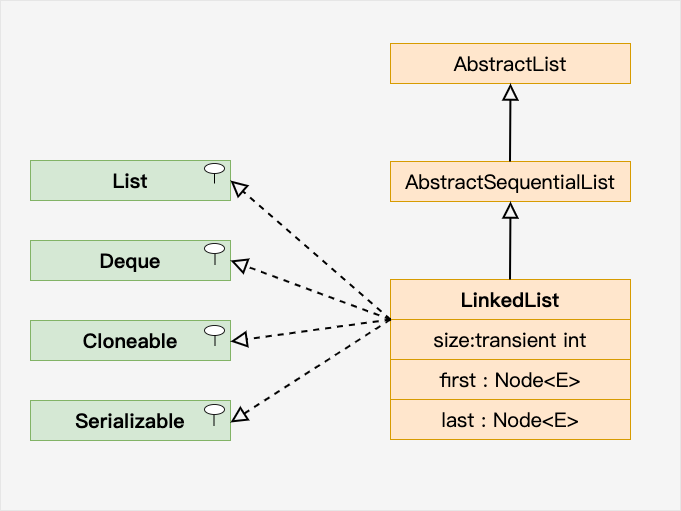
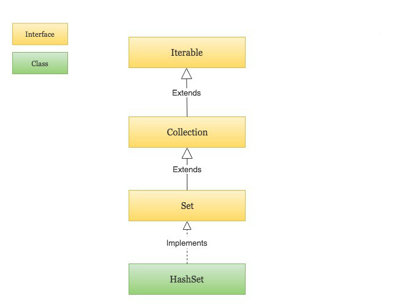
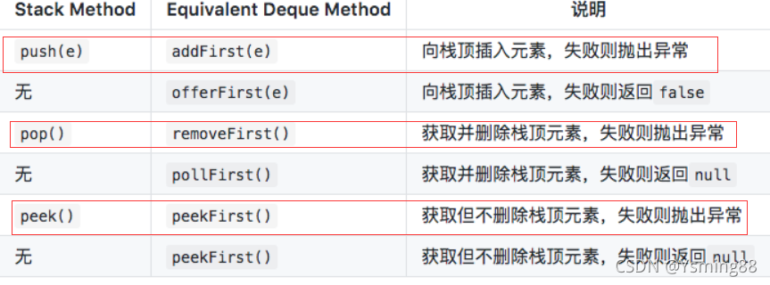
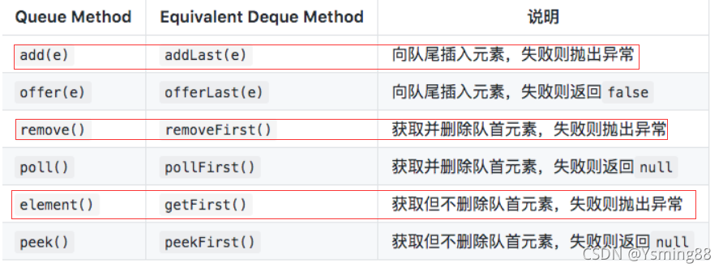
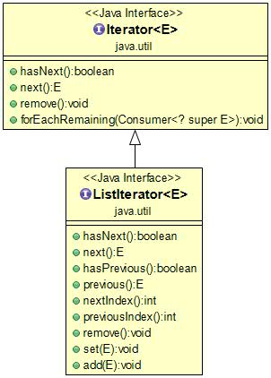

## Day11

### Java LinkedList

链表（Linked list）是一种常见的基础数据结构，是一种线性表，但是并不会按线性的顺序存储数据，而是在每一个节点里存到下一个节点的地址。

Java LinkedList（链表） 类似于 ArrayList，是一种常用的数据容器。

与 ArrayList 相比，LinkedList 的增加和删除的操作效率更高，而查找和修改的操作效率较低。


**以下情况使用 ArrayList :**

- 频繁**访问**列表中的某一个元素。
- 只需要在列表**末尾**进行添加和删除元素操作。

**以下情况使用 LinkedList :**

- 你需要通过循环迭代来访问列表中的某些元素。
- 需要频繁的在列表开头、中间、末尾等位置进行**添加和删除**元素操作。

LinkedList 继承了 AbstractSequentialList 类。

**LinkedList 实现了 Queue 接口，可作为队列使用。**

LinkedList 实现了 List 接口，可进行列表的相关操作。

**LinkedList 实现了 Deque 接口，可作为双端队列使用。**

LinkedList 实现了 Cloneable 接口，可实现克隆。

LinkedList 实现了 java.io.Serializable 接口，即可支持序列化，能通过序列化去传输。



```java
// 引入 LinkedList 类
import java.util.LinkedList; 

LinkedList<E> list = new LinkedList<E>();   // 普通创建方法
或者
LinkedList<E> list = new LinkedList(Collection<? extends E> c); // 使用集合创建链表
```

```java
// 引入 LinkedList 类
import java.util.LinkedList;

public class RunoobTest {
    public static void main(String[] args) {
        LinkedList<String> sites = new LinkedList<String>();
        sites.add("Google");
        sites.add("Runoob");
        sites.add("Taobao");
        // 使用 addFirst() 在头部添加元素
        sites.addFirst("Wiki");
        System.out.println(sites);
        // 使用 addLast() 在尾部添加元素
        sites.addLast("Wiki");
        System.out.println(sites);
        // 使用 removeFirst() 移除头部元素
        sites.removeFirst();
        System.out.println(sites);
        // 使用 removeLast() 移除尾部元素
        sites.removeLast();
        System.out.println(sites);
        // 使用 getFirst() 获取头部元素
        System.out.println(sites.getFirst());
        // 使用 getLast() 获取尾部元素
        System.out.println(sites.getLast());
    }
}
```

### 迭代元素

我们可以使用 for 配合 size() 方法来迭代列表中的元素：

```java
for (int size = sites.size(), i = 0; i < size; i++) {
    System.out.println(sites.get(i));
}
```

也可以使用 for-each 来迭代元素：

```java
for (String i : sites) {
    System.out.println(i);
}
```

| 方法                                           | 描述                                                         |
| :--------------------------------------------- | :----------------------------------------------------------- |
| public **boolean** add(E e)                    | 链表**末尾**添加元素，返回是否成功，成功为 true，失败为 false。 |
| public **void** add(int index, E element)      | **向指定位置插入元素。**                                     |
| public boolean addAll(Collection c)            | 将一个集合的所有元素添加到链表后面，返回是否成功，成功为 true，失败为 false。 |
| public boolean addAll(int index, Collection c) | 将一个集合的所有元素添加到链表的指定位置后面，返回是否成功，成功为 true，失败为 false。 |
| public void addFirst(E e)                      | 元素添加到头部。                                             |
| public void addLast(E e)                       | 元素添加到尾部。                                             |
| public boolean **offer(E e)**                  | 向链表末尾添加元素，返回是否成功，成功为 true，失败为 false。 |
| public boolean offerFirst(E e)                 | 头部插入元素，返回是否成功，成功为 true，失败为 false。      |
| public boolean offerLast(E e)                  | 尾部插入元素，返回是否成功，成功为 true，失败为 false。      |
| public void **clear()**                        | 清空链表。                                                   |
| public E removeFirst()                         | 删除并返回第一个元素。                                       |
| public E removeLast()                          | 删除并返回最后一个元素。                                     |
| public boolean remove(Object o)                | 删除某一元素，返回是否成功，成功为 true，失败为 false。      |
| public E **remove(int index)**                 | 删除指定位置的元素。                                         |
| public E **poll()**                            | 删除并返回第一个元素。                                       |
| public E remove()                              | 删除并返回第一个元素。                                       |
| public boolean **contains(Object o)**          | 判断是否含有某一元素。                                       |
| public E **get(int index)**                    | 返回指定位置的元素。                                         |
| public E getFirst()                            | 返回第一个元素。                                             |
| public E getLast()                             | 返回最后一个元素。                                           |
| public int **indexOf(Object o)**               | 查找指定元素从前往后第一次出现的索引。                       |
| public int **lastIndexOf(Object o)**           | 查找指定元素最后一次出现的索引。                             |
| public E **peek()**                            | 返回第一个元素。                                             |
| public E element()                             | 返回第一个元素。                                             |
| public E peekFirst()                           | 返回头部元素。                                               |
| public E **peekLast()**                        | 返回尾部元素。                                               |
| public E **set(int index, E element)**         | 设置指定位置的元素。                                         |
| public Object clone()                          | 克隆该列表。                                                 |
| public Iterator descendingIterator()           | 返回倒序迭代器。                                             |
| public int **size()**                          | 返回链表元素个数。                                           |
| public ListIterator listIterator(int index)    | 返回从指定位置开始到末尾的迭代器。                           |
| public Object[] toArray()                      | 返回一个由链表元素组成的数组。                               |
| public T[] toArray(T[] a)                      | 返回一个由链表元素转换类型而成的数组。                       |


## Java HashSet

HashSet 基于 HashMap 来实现的，是一个不允许有重复元素的集合。

HashSet 允许有 null 值。

HashSet 是无序的，即不会记录插入的顺序。

HashSet **不是线程安全的**， 如果多个线程尝试同时修改 HashSet，则最终结果是不确定的。 您必须在多线程访问时显式同步对 HashSet 的并发访问。

HashSet 实现了 Set 接口。



```java
import java.util.HashSet; // 引入 HashSet 类
HashSet<String> sites = new HashSet<String>();
```

### 添加元素

HashSet 类提供了很多有用的方法，添加元素可以使用 add() 方法:

```java
sites.add("Runoob");  // 重复的元素不会被添加
```

### 判断元素是否存在

我们可以使用 contains() 方法来判断元素是否存在于集合当中:

```java
System.out.println(sites.contains("Taobao"));
```

### 删除元素

我们可以使用 remove() 方法来删除集合中的元素:

```java
sites.remove("Taobao");  // 删除元素，删除成功返回 true，否则为 false
System.out.println(sites);
```

删除集合中所有元素可以使用 clear 方法

### 计算大小

如果要计算 HashSet 中的元素数量可以使用 size() 方法

### 迭代 HashSet

可以使用 for-each 来迭代 HashSet 中的元素。

### 附录

加载因子（Load Factor）是与哈希表（Hash Table）相关的一个概念，通常用于调整哈希表的性能和内存消耗之间的平衡。

加载因子 = 已使用存储桶数 / 总存储桶数

通常，哈希表的实现会在加载因子达到一定阈值时自动进行扩容，以减少冲突并维持性能。扩容通常会导致存储桶数翻倍，同时重新散列存储桶中的元素。这个过程在时间和内存消耗方面都有开销，因此合适的加载因子选择对于维护哈希表的性能至关重要。

通常，加载因子的典型值是0.7或0.75，但实际选择可能因具体应用和性能需求而有所不同。如果你需要更高的内存利用率，可以选择较高的加载因子，但需要牺牲一些性能。如果性能是首要考虑因素，可以选择较低的加载因子。

| 构造器      | 描述                                                         |
| :---------- | :----------------------------------------------------------- |
| `HashSet()` | 构造一个新的空集; 支持`HashMap`实例具有默认初始容量（16）和加载因子（0.75）。 |

| 变量和类型    | 方法                 | 描述                                             |
| :------------ | :------------------- | :----------------------------------------------- |
| `boolean`     | `add(E e)`           | 如果指定的元素尚不存在，则将其添加到此集合中。   |
| `void`        | `clear()`            | 从该集中删除所有元素。                           |
| `Object`      | `clone()`            | 返回此 `HashSet`实例的浅表副本：未克隆元素本身。 |
| `boolean`     | `contains(Object o)` | 如果此set包含指定的元素，则返回 `true` 。        |
| `boolean`     | `isEmpty()`          | 如果此集合不包含任何元素，则返回 `true` 。       |
| `Iterator<E>` | `iterator()`         | 返回此set中元素的迭代器。                        |
| `boolean`     | `remove(Object o)`   | 如果存在，则从该集合中移除指定的元素。           |
| `int`         | `size()`             | 返回此集合中的元素数（基数）                     |

### 附录

栈实现（利用deque）



队列实现（利用deque）



上面两个表共定义了Deque的12个接口。添加，删除，取值都有两套接口，它们功能相同，区别是对失败情况的处理不同。一套接口遇到失败就会抛出异常，另一套遇到失败会返回特殊值（false或null）。除非某种实现对容量有限制，大多数情况下，添加操作是不会失败的。虽然Deque的接口有12个之多，但无非就是对容器的两端进行操作，或添加，或删除，或查看。
**ArrayDeque和LinkedList是Deque的实现子类，他们都能使用Deque的这12个方法，包括isEmpty()判断是否为空方法和size()栈和队列的大小**

ArrayDeque
当需要使用栈和队列是官方推荐的是ArrayDeque（但我刷题的时候感觉LinkedList也很常用，甚至可能用的更多一点）

从名字可以看出ArrayDeque底层通过数组实现，为了满足可以同时在数组两端插入或删除元素的需求，该数组还必须是循环的，即循环数组（circular array），也就是说数组的任何一点都可能被看作起点或者终点。ArrayDeque是**非线程安全的**（not thread-safe），当多个线程同时使用的时候，需要程序员手动同步；**另外，该容器不允许放入null元素。**


以下LinkedList实现栈和队列的等价方法与ArrayDeque相同

LinkedList
LinkedList实现了Deque接口,因此其具备双端队列的特性,由于其是链表结构,，双向链表，因此不像ArrayDeque要考虑越界问题,容量问题,那么对应操作就很简单了（另外当需要使用栈和队列是官方推荐的是ArrayDeque）

LinkedList作为LIFO（后进先出）的栈时，下表的方法等价：

```bash
栈方法        等效方法
push(e)      addFirst(e)
pop()        removeFirst()
peek()       peekFirst()

注：同时LinkedList本身也有push(e)，pop()，peek() 方法，功能一致

	Deque<Integer> stack = new LinkedList<Integer>();
	这种情况下别忘了标明泛型
```

LinkedList作为FIFO(先进先出)的队列时，下表的方法等价：

```bash
队列方法       等效方法
add(e)        addLast(e)
remove()      removeFirst()
element()     getFirst()

注：同时LinkedList本身也有add(e)，remove()方法，功能一致
```

## Java HashMap

HashMap 是一个散列表，它存储的内容是键值对(key-value)映射。

HashMap 实现了 Map 接口，根据键的 HashCode 值存储数据，具有很快的访问速度，最多允许一条记录的键为 null，不支持线程同步。

HashMap 是无序的，即不会记录插入的顺序。

HashMap 继承于AbstractMap，实现了 Map、Cloneable、java.io.Serializable 接口。


HashMap 的 key 与 value 类型可以相同也可以不同，可以是字符串（String）类型的 key 和 value，也可以是整型（Integer）的 key 和字符串（String）类型的 value。

```java
HashMap<Integer, String> Sites = new HashMap<Integer, String>();
```

### 添加元素

HashMap 类提供了很多有用的方法，添加键值对(key-value)可以使用 put() 方法:

```java
// 创建 HashMap 对象 Sites
HashMap<Integer, String> sites = new HashMap<Integer, String>();
// 添加键值对
sites.put(1, "Google");
```

### 访问元素

我们可以使用 get(key) 方法来获取 key 对应的 value:

```java
System.out.println(sites.get(3));
```

### 删除元素

我们可以使用 remove(key) 方法来删除 key 对应的键值对(key-value):

```java
sites.remove(4);
```

删除所有键值对(key-value)可以使用 clear 方法：

```java
sites.clear();
```

### 计算大小

如果要计算 HashMap 中的元素数量可以使用 size() 方法

```java
System.out.println(sites.size());
```

### 迭代 HashMap

可以使用 for-each 来迭代 HashMap 中的元素。

如果你只想获取 key，可以使用 keySet() 方法，然后可以通过 get(key) 获取对应的 value，如果你只想获取 value，可以使用 values() 方法。

```java
// 引入 HashMap 类      
import java.util.HashMap;

public class RunoobTest {
    public static void main(String[] args) {
        // 创建 HashMap 对象 Sites
        HashMap<Integer, String> sites = new HashMap<Integer, String>();
        // 添加键值对
        sites.put(1, "Google");
        sites.put(2, "Runoob");
        sites.put(3, "Taobao");
        sites.put(4, "Zhihu");
        // 输出 key 和 value
        for (Integer i : sites.keySet()) {
            System.out.println("key: " + i + " value: " + sites.get(i));
        }
        // 返回所有 value 值
        for(String value: sites.values()) {
          // 输出每一个value
          System.out.print(value + ", ");
        }
    }
}
```

### Java HashMap 方法

| 方法                                                         | 描述                                                         |
| :----------------------------------------------------------- | :----------------------------------------------------------- |
| [clear()](https://www.runoob.com/java/java-hashmap-clear.html) | 删除 hashMap 中的所有键/值对                                 |
| [clone()](https://www.runoob.com/java/java-hashmap-clone.html) | 复制一份 hashMap                                             |
| [isEmpty()](https://www.runoob.com/java/java-hashmap-isempty.html) | 判断 hashMap 是否为空                                        |
| [size()](https://www.runoob.com/java/java-hashmap-size.html) | 计算 hashMap 中键/值对的数量                                 |
| [put()](https://www.runoob.com/java/java-hashmap-put.html)   | 将键/值对添加到 hashMap 中                                   |
| [putAll()](https://www.runoob.com/java/java-hashmap-putall.html) | 将所有键/值对添加到 hashMap 中                               |
| [remove()](https://www.runoob.com/java/java-hashmap-remove.html) | 删除 hashMap 中指定键 key 的映射关系                         |
| [containsKey()](https://www.runoob.com/java/java-hashmap-containskey.html) | 检查 hashMap 中是否存在指定的 key 对应的映射关系。           |
| [containsValue()](https://www.runoob.com/java/java-hashmap-containsvalue.html) | 检查 hashMap 中是否存在指定的 value 对应的映射关系。         |
| [replace()](https://www.runoob.com/java/java-hashmap-replace.html) | 替换 hashMap 中是指定的 key 对应的 value。                   |
| [replaceAll()](https://www.runoob.com/java/java-hashmap-replaceall.html) | 将 hashMap 中的所有映射关系替换成给定的函数所执行的结果。    |
| [get()](https://www.runoob.com/java/java-hashmap-get.html)   | 获取指定 key 对应对 value                                    |
| [getOrDefault()](https://www.runoob.com/java/java-hashmap-getordefault.html) | 获取指定 key 对应对 value，如果找不到 key ，则返回设置的默认值 |
| [forEach()](https://www.runoob.com/java/java-hashmap-foreach.html) | 对 hashMap 中的每个映射执行指定的操作。                      |
| [entrySet()](https://www.runoob.com/java/java-hashmap-entryset.html) | 返回 hashMap 中所有映射项的集合集合视图。                    |
| [keySet](https://www.runoob.com/java/java-hashmap-keyset.html)() | 返回 hashMap 中所有 key 组成的集合视图。                     |
| [values()](https://www.runoob.com/java/java-hashmap-values.html) | 返回 hashMap 中存在的所有 value 值。                         |


## Java Iterator（迭代器）

Java迭代器（Iterator）是 Java 集合框架中的一种机制，是一种用于遍历集合（如列表、集合和映射等）的接口。

它提供了一种统一的方式来访问集合中的元素，而不需要了解底层集合的具体实现细节。

Java Iterator（迭代器）不是一个集合，它是一种用于访问集合的方法，可用于迭代 [ArrayList](https://www.runoob.com/java/java-arraylist.html) 和 [HashSet](https://www.runoob.com/java/java-hashset.html) 等集合。

Iterator 是 Java 迭代器最简单的实现，ListIterator 是 Collection API 中的接口， 它扩展了 Iterator 接口。



迭代器接口定义了几个方法，最常用的是以下三个：

- **next()** - 返回迭代器的下一个元素，并将迭代器的指针移到下一个位置。
- **hasNext()** - 用于判断集合中是否还有下一个元素可以访问。
- **remove()** - 从集合中删除迭代器最后访问的元素（可选操作）。

```java
// 引入 ArrayList 和 Iterator 类
import java.util.ArrayList;
import java.util.Iterator;

public class RunoobTest {
    public static void main(String[] args) {

        // 创建集合
        ArrayList<String> sites = new ArrayList<String>();
        sites.add("Google");
        sites.add("Runoob");
        sites.add("Taobao");
        sites.add("Zhihu");

        // 获取迭代器
        Iterator<String> it = sites.iterator();

        // 输出集合中的第一个元素
        System.out.println(it.next());
    }
}
```

### 循环集合元素

让迭代器 it 逐个返回集合中所有元素最简单的方法是使用 while 循环：

```
while(it.hasNext()) {
    System.out.println(it.next());
}
```

删除元素

要删除集合中的元素可以使用 remove() 方法。

```java
// 引入 ArrayList 和 Iterator 类
import java.util.ArrayList;
import java.util.Iterator;

public class RunoobTest {
    public static void main(String[] args) {
        ArrayList<Integer> numbers = new ArrayList<Integer>();
        numbers.add(12);
        numbers.add(8);
        numbers.add(2);
        numbers.add(23);
        Iterator<Integer> it = numbers.iterator();
        while(it.hasNext()) {
            Integer i = it.next();
            if(i < 10) {  
                it.remove();  // 删除小于 10 的元素
            }
        }
        System.out.println(numbers);
    }
}
```

**注意：**Java 迭代器是一种单向遍历机制，即只能从前往后遍历集合中的元素，不能往回遍历。同时，在使用迭代器遍历集合时，不能直接修改集合中的元素，而是需要使用迭代器的 remove() 方法来删除当前元素。