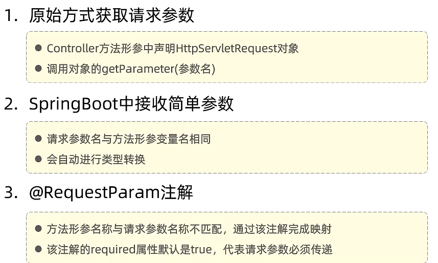
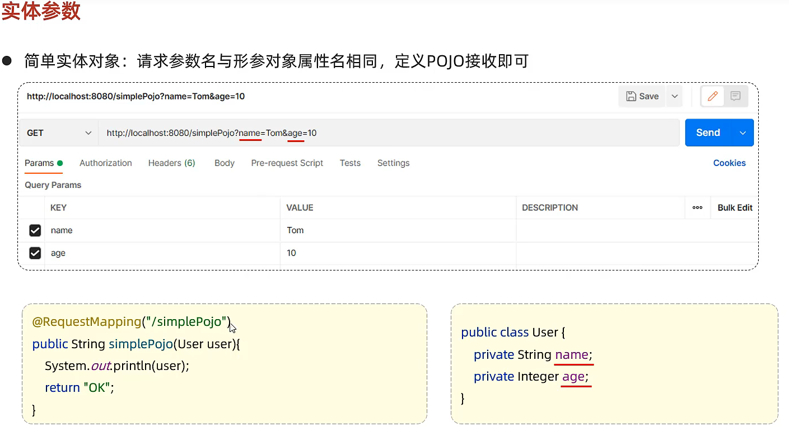

## Day19

### Postman相关

1. 工作空间可以云端同步
2. Post请求参数在body中

### Web相关

对于Get请求

原始方式

1. 使用 HttpServletRequest 接收信息
2. 调用getParameter方法

SpringBoot方式

1. 利用自动类型转换，直接在参数里写就好了
2. 需要参数对应上
3. 如果加上@RequestParam，则可以指定转换

简单实体对象，请求参数名需要和形参对象属性参数名相同

