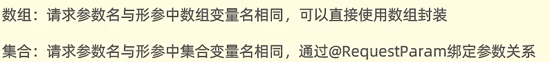
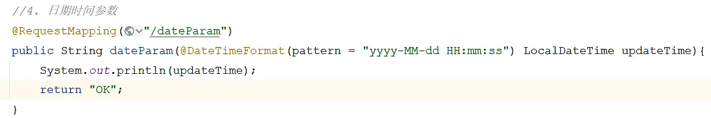
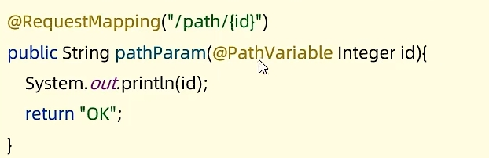
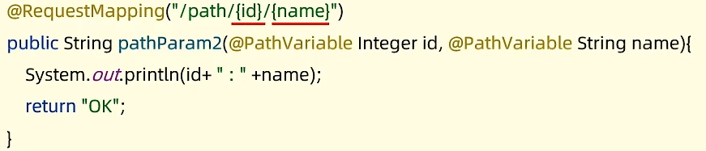
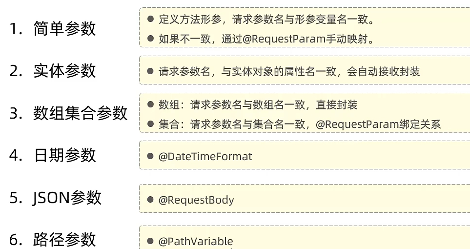
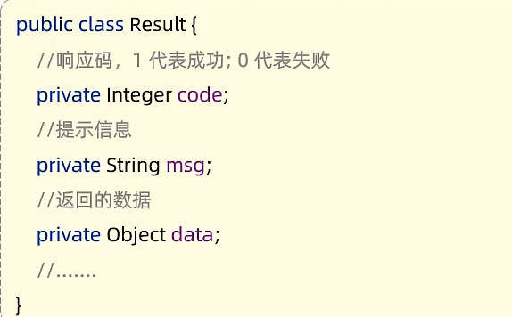

## Day20

JavaWeb

@RequestParam 用于封装集合对象

不写可以封装到同名数组

日期参数需要前面加入注解

@DateTimeFormat

Json中的Key需要加双引号

需要和前端保持一致

@RequestBody 提前定义好接收对象

路径参数接收 @RequestMapping中需要用大括号引用出来

@PathVariable

多个参数也可以

总结

### 统一响应结果

